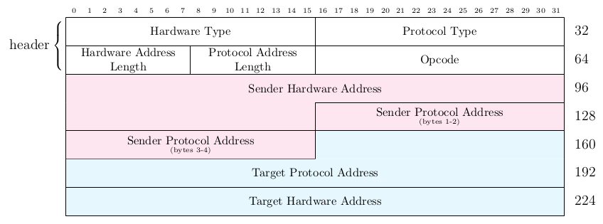

# packet structure diagrams
LaTeX files used to generate packet structure diagrams for various networking protocols

These files can be used to generate packet structure diagrams using the XeLaTeX interpreter.
If you just want to generate some of them quickly try www.overleaf.com (don't forget to set the correct interpreter).

I plan on writing a script to generate these documents using a simpler file format to define the packet structure, e.g. YAML.
